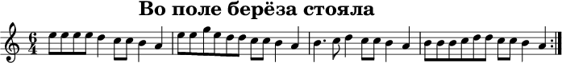
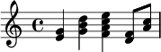
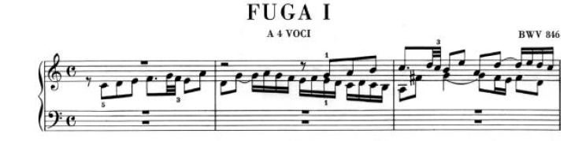
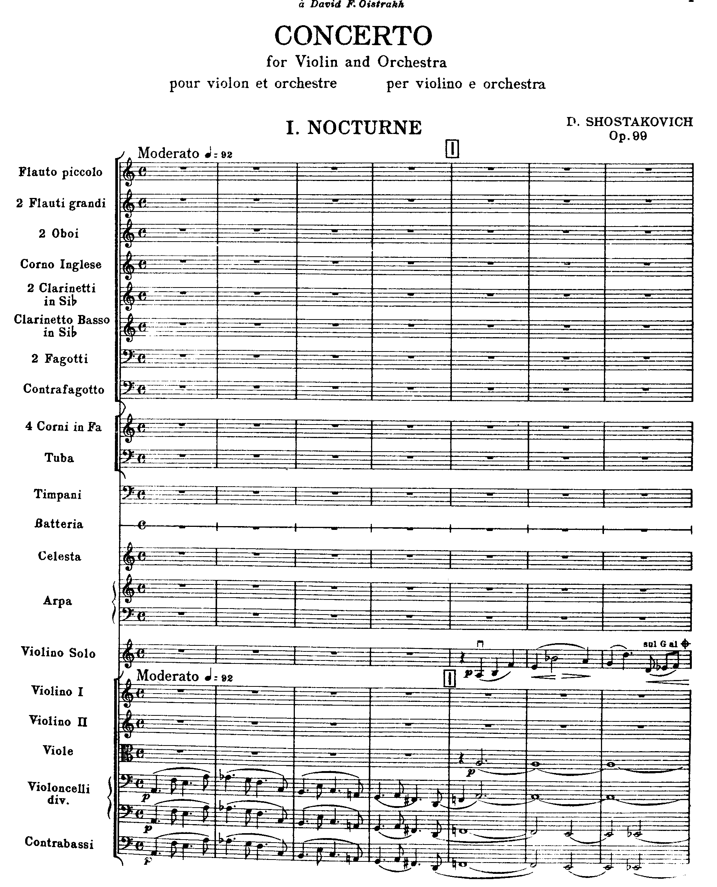

# Описание системы "вывод музыки в мобильном приложении IOS“ c backend на linux.

## Основные принципы

Первоначальная версия клиента написана на QT. В дальнейшем планируется освоить нативные приложения на swift и создать родную версию под iOS. Сервер - С++, linux. Коммуникация между клиентом и сервером осуществляется по HTTP либо TCP/IP (websockets). На клиента сразу дается низкоуровневая физическая модель данных, пригодная для отображения в любом требуемом масштабе. Логическая модель данных (конкретные ноты, тональность и проч.) туда не подается.

## Протокол взаимодействия.

Сообщение "Отобразить ноты".

Последовательность байт, означающая вывод всего произведения. Закодированы все физические элементы. Размер каждого элемента варьируется от 1 до 4 байт. Объекты вводятся по "Современной музыкальной нотации". https://ru.wikipedia.org/wiki/%D0%A1%D0%BE%D0%B2%D1%80%D0%B5%D0%BC%D0%B5%D0%BD%D0%BD%D0%B0%D1%8F_%D0%BC%D1%83%D0%B7%D1%8B%D0%BA%D0%B0%D0%BB%D1%8C%D0%BD%D0%B0%D1%8F_%D0%BD%D0%BE%D1%82%D0%B0%D1%86%D0%B8%D1%8F

**0-й байт - тип объекта и основные свойства**

**Биты 0-3 - тип объекта**

0 (0000) - акколада, скобка, тактовая черта

1 (0001) - ключ

2 (0010) - размер

3 (0011) - нота

4 (0100) - пауза

5 (0101) - знак альтерации/ключевой знак

6 (0110) - темп, темп метронома

7 (0111) - перенос на октаву

8 (1000) - повторения и окончания (реприза, вольта)

9 (1001) - педаль

A (1010) - текст

B (1011) - метаинформация о произведении

**Объект "Тактовая черта, акколада, скобка"**

**0-й байт**

**Биты 4-7**

0 (0000) - обычная тактовая черта

1 (0001) - двойная тактовая черта

2 (0010) - жирная двойная тактовая черта, конец произведения или части

3 (0011) - пунктирная тактовая черта

4 (0101) - скобка

5 (0110) - акколада

**1-й байт**

**Биты 0 - 6**

Число нотных станов, связанных тактовой чертой/акколадой/скобкой 1 - 63

**Бит 7** **- нотоносец**

0 - следующая нота/пауза/объект находится на том же нотоносце

1 - следующая нота/пауза/объект находится на следующем нотоносце

**Объект "Ключ"**

**0-й байт**

**Биты 4-7**

0 - скрипичный ключ

1 - басовый ключ

2 - альтовый ключ

3 - теноровый ключ

4 - нейтральный ключ (в байте 1 расшифровка)

5 - скрипичный со сдвигом на 1 окт вверх

6 - скрипичный со сдвигом на 2 окт вверх

7 - скрипичный со сдвигом на 1 окт вниз

8 - скрипичный со сдвигом на 2 окт вниз

9 - басовый со сдвигом на 1 окт вверх

A - басовый со сдвигом на 2 окт вверх

B - басовый со сдвигом на 1 окт вниз

C - басовый со сдвигом на 2 окт вниз

D - таблатура

**1-й байт**

0 - нейтральный ключ 1, 5 линеек

1 - нейтральный ключ 2, 5 линеек

2 - нейтральный ключ 1, 1 линейка

3 - нейтральный ключ 2, 1 линейка

**Объект "Размер"**

**0-й байт**

**Биты 4-7**

0 - размер С

1 - размер С перечеркнутое (alla breve)

2 - иной размер

**1-й байт**

**Числитель размера 0-255**

**2-й байт**

**Знаменатель размера 0-255**

**Объект "Нота".**

**0-й байт**

**Биты 4 - 7 - длительность.**

0 (0000) - максима

1 (0001) - лонга

2 (0010) - бревис

3 (0011) - целая

4 (0100) - половинная

5 (0101) - четвертная

6 (0110) - восьмая

7 (0111) - шестнадцатая

8 (1000) - тридцатьвторая

9 (1001) - шестьдесятчетвертая

A (1010) - стодвадцатьвосьмая

B (1011) - двестипятьдесятшестая

C (1100) - **для пауз** - оркестровая пауза, количество тактов в байте 2.

D (1101) - **для пауз** - люфтпауза

E (1110) - **для пауз** - цезура

**1-й байт - высота, точки для длительности**

**Биты 0 - 5 - высота**

00 (000000) - -6 строчка

01 (000001) - между -6 и -5 строчкой

02 (000010) - -5 строчка

03 (000011) - между -5 и -4 строчкой

04 (000100) - -4 строчка

05 (000101) - между -4 и -3 строчкой

06 (000110) - -3 строчка

07 (000111) - между -3 и -2 строчкой

08 (001000) - -2 строчка

09 (001001) - между -2 и -1 строчкой

0A (001010) - -1 строчка

0B (001011) - между -1 и 1 строчкой

0C (001100) - 1 строчка

0D (001101) - между 1 и 2 строчкой

0E (001110) - 2 строчка

0F (001111) - между 2 и 3 строчкой

10 (010000) - 3 строчка

11 (010001) - между 3 и 4 строчкой

12 (010010) - 4 строчка

13 (010011) - между 4 и 5 строчкой

14 (010100) - 5 строчка

15 (010101) - между 5 и +1 строчкой

16 (010110) - +1 строчка

17 (010111) - между +1 и +2 строчкой

18 (011000) - +2 строчка

19 (011001) - между +2 и +3 строчкой

1A (011010) - +3 строчка

1B (011011) - между +3 и +4 строчкой

1C (011100) - +4 строчка

1D (011101) - между +4 и +5 строчкой

1E (011110) - +5 строчка

1F (011111) - между +5 и +6 строчкой

20 (100000) - +6 строчка

**Бит 6 - аккорд**

0 - нет следующей ноты на том же штиле

1 - имеется следующая нота на том же штиле

**Бит 7** **- нотоносец**

0 - следующая нота/пауза/объект находится на следующем нотоносце (если их 1, то на том же)

1 - следующая нота/пауза/объект находится на том же нотоносце

**2-й байт**

**Биты 0 - 3 - динамика.**

0 (0000) - ничего,

1 (0001) - pppppp

2 (0010) - ppppp

3 (0011) - pppp

4 (0100) - ppp

5 (0101) - pp

6 (0110) - p

7 (0111) - mp

8 (1000) - mf

9 (1001) - f

A (1010) - ff

B (1011) - fff

C (1100) - ffff

D (1101) - fffff

E (1110) - ffffff

F (1111) - sfz.

**Биты 4 - 7 - иное**

0 - ничего

1 - начало вилки крещендо

2 - конец вилки крещендо

3- начало вилки диминуэндо

4 - конец вилки диминуэндо

5 - начало связующей лиги

6 - конец связующей лиги

7 - начало глиссандо

8 - конец глиссандо

**3-й байт - модификатор объекта, артикуляция.**

**Бит 0** - штиль, 0 - вверх, 1 - вниз

**Бит 1** - продлевающая лига на следующую ноту, 0 - нет, 1 - есть

**Бит 2 ** - флаг числа повторений ноты

0 - одно повторение

1 - число повторений записывается в байте 4.

**Биты 3 - 7** 

00 - ничего

01 - стакатто

02 - стакатиссимо

03 - акцент

04 - пиццикато левой рукой

05 - щелкающее пиццикато

06 - натуральный флажолет

07 - тенуто

08 - фермата

09 - смычок вверх

0A - смычок вниз

0B - вибрато

0C - трель

0D - мордент

0E - группетто

0F - форшлаг долгий

10 - форшлаг короткий

11 - тремоло

**4-й байт управляющий**

**Биты 0-3 - к-во повторений ноты.**

**Биты 4 - аппликатура**

**0 - нет**

**1- есть в байте 5**

**Бит 5 зарезервирован, **

**Биты 6-7**

0 - нет точки, увеличивающей длительность

1 - одна точка

2 - две точки

3 - три точки

**5-й байт**

**Биты 0 - 2 аппликатура**

0 (000) - 1-й палец

1 (001) - 2-й палец

2 (010) - 3-й палец

3 (011) - 4-й палец

4 (100) - 5-й палец

**Биты 3 - 7 зарезервированы**

**Объект "Пауза".**

**0-й байт**

**Биты 4 - 7 - длительность. Аналогично длительности объекта "Нота".**

**1-й байт**

**Высота (положение) паузы, точки для длительности. Аналогично объекту "Нота".**

**Объект "Знаки альтерации и ключевые знаки".**

**0-й байт. **

**Биты 4 - 7.**

00 - бекар

01 - диез

02 - бемоль

03 - дубль-диез

04 - дубль-бемоль

05 - полудиез

06 - полубемоль

07 - полуторадиез

08 - полуторабемоль

09 - бекар в скобках

0A - диез в скобках

0B - бемоль в скобках

0C - дубль-диез в скобках

0D - дубль-бемоль в скобках

0E - полудиез в скобках

0F - полубемоль в скобках

**1-й байт**

**Высота (положение) знака альтерации/ключевого знака. Аналогично объекту "Нота".**

**Объект "Темп метронома".**

**0-й байт. **

**Биты 4 - 7 - длительность метронома.**

0 (0000) - лонга

1 (0001) - бревис

2 (0010) - целая

3 (0011) - половинная

4 (0100) - четвертная

5 (0101) - восьмая

6 (0110) - шестнадцатая

7 (0111) - тридцатьвторая

8 (1000) - шестьдесятчетвертая

9 (1001) - стодвадцатьвосьмая

A (1010) - двестипятьдесятшестая

**1-й байт**

**Биты 0-6**

**Темп метронома 0 - 127**

**Бит 7** **- нотоносец**

0 - следующая нота/пауза/объект находится на том же нотоносце

1 - следующая нота/пауза/объект находится на следующем нотоносце

**2-й байт**

**Длина названия темпа 0 - 255**

**3-й и последующий байты**

**Название темпа**

**Объект "Перенос на октаву".**

**0-й байт. **

**Биты 4 - 7 - вид переноса на октаву.**

0 - выше на октаву

1 - ниже на октаву

2 - выше на 2 октавы

3 - ниже на 2 октавы

**1-й байт**

**Бит 7** **- нотоносец**

0 - следующая нота/пауза/объект находится на том же нотоносце

1 - следующая нота/пауза/объект находится на следующем нотоносце

**Объект "Повторения и окончания".**

**0-й байт. **

**Биты 4 - 7 - вид повторения и окончания.**

0 - реприза начало

1 - реприза конец

2 - вольта начало (номер вольты в байте 1)

3 - вольта конец (номер вольты в байте 1)

4 - Da Capo

5 - Dal Segno

6 - Segno

7 - Coda

8 - повтор 1

9 - повтор 2

**1-й байт - номер вольты**

**Биты 0 - 6 - номер вольты (1 - 126)**

**Бит 7** **- нотоносец**

0 - следующая нота/пауза/объект находится на том же нотоносце

1 - следующая нота/пауза/объект находится на следующем нотоносце

**Объект "Педаль".**

**0-й байт. **

**Биты 4 - 7 - вид педали.**

0 - нажать педаль

1 - снять педаль

2 - педаль вниз

3 - педаль вверх

**1-й байт**

**Бит 7** **- нотоносец**

0 - следующая нота/пауза/объект находится на том же нотоносце

1 - следующая нота/пауза/объект находится на следующем нотоносце

**Объект "Текст".**

**0-й байт.**

**Биты 4 - 7 - вид текста.**

0 - название (выводится вверху по центру на 1-й странице вверху)

1 - текст слева (выводится вверху слева на 1-й странице)

2 - текст справа (выводится вверху справа на 1-й странице)

3 - название нотоносца (инструмент)

4 - "цифры" 1..256 в квадратах. Выводятся над текущим нотным станом.

**1-й байт - размер шрифта текста 1-256. Может быть несколько объектов "текст".  Для “цифр” - сама цифра -1**

**2-й байт - длина текста. Далее идет сам текст**

**Объект "Метаинформация о произведении"**

**0-й байт.**

**Биты 4 - 7 - вид метаинформации**

0 - группировка

1 - число нотоносцев

**1-й байт**:

группировка: 0 - инструментальная, 1 - вокальная, по дефолту 0 (инструментальная)

число нотоносцев: 1 - 254 (может меняться по ходу произведения), по дефолту 1

## Сводная таблица

<table>
  <tr>
    <td></td>
    <td>Байт 0
Биты 0 - 3</td>
    <td>Байт 0
Биты 4 - 7</td>
    <td>Байт 1</td>
    <td>Байт 2</td>
    <td>Байт 3</td>
    <td>Байт 4</td>
    <td>Байт 5</td>
  </tr>
  <tr>
    <td>тактовая черта/акколада/скобка</td>
    <td>0</td>
    <td>0 - 4 вид черты</td>
    <td>число нотных станов</td>
    <td>-</td>
    <td>-</td>
    <td>-</td>
    <td>-</td>
  </tr>
  <tr>
    <td>ключ</td>
    <td>1</td>
    <td>0 - D вид ключа</td>
    <td>доп информация</td>
    <td>-</td>
    <td>-</td>
    <td>-</td>
    <td>-</td>
  </tr>
  <tr>
    <td>размер</td>
    <td>2</td>
    <td>0 - 2 вид</td>
    <td>числитель размера</td>
    <td>знаменатель размера</td>
    <td>-</td>
    <td>-</td>
    <td>-</td>
  </tr>
  <tr>
    <td>нота</td>
    <td>3</td>
    <td>0 - A длительность</td>
    <td>высота, точки для длительности</td>
    <td>динамика</td>
    <td>артикуляция</td>
    <td>к-во повторений ноты</td>
    <td>аппликатура</td>
  </tr>
  <tr>
    <td>пауза</td>
    <td>4</td>
    <td>0 - A длительность</td>
    <td>высота, точки для длительности</td>
    <td>к-во тактов для оркестровой паузы</td>
    <td>-</td>
    <td>-</td>
    <td>-</td>
  </tr>
  <tr>
    <td>знак альтерации/ключевой знак</td>
    <td>5</td>
    <td>0 - С вид</td>
    <td>-</td>
    <td>-</td>
    <td>-</td>
    <td>-</td>
    <td>-</td>
  </tr>
  <tr>
    <td>темп метронома</td>
    <td>6</td>
    <td>0 - A длительность</td>
    <td>темп</td>
    <td>-</td>
    <td>-</td>
    <td>-</td>
    <td>-</td>
  </tr>
  <tr>
    <td>перенос на октаву</td>
    <td>7</td>
    <td>вид переноса на октаву</td>
    <td>-</td>
    <td>-</td>
    <td>-</td>
    <td>-</td>
    <td>-</td>
  </tr>
  <tr>
    <td>повторения и окончания (реприза, вольта)</td>
    <td>8</td>
    <td>вид знака повторения и окончания</td>
    <td>номер вольты</td>
    <td>-</td>
    <td>-</td>
    <td>-</td>
    <td>-</td>
  </tr>
  <tr>
    <td>педаль</td>
    <td>9</td>
    <td>вид педали</td>
    <td>-</td>
    <td>-</td>
    <td>-</td>
    <td>-</td>
    <td>-</td>
  </tr>
  <tr>
    <td>текст</td>
    <td>A</td>
    <td>вид текста</td>
    <td>длина</td>
    <td>текст</td>
    <td>...</td>
    <td>...</td>
    <td>-</td>
  </tr>
  <tr>
    <td>метаинформация</td>
    <td>B</td>
    <td>вид метаинформации</td>
    <td>информация</td>
    <td>-</td>
    <td>-</td>
    <td>-</td>
    <td>-</td>
  </tr>
</table>

## Как передается информации о нотном тексте?

Информация передается по всем звучащим голосам последовательно сверху вниз и слева направо. 

## Примеры

**Пример 1.**

<table>
  <tr>
    <td>название</td>
    <td>0A 00 15 "Во поле береза стояла"</td>
  </tr>
  <tr>
    <td>скрипичный ключ</td>
    <td>01</td>
  </tr>
  <tr>
    <td>размер 6/4</td>
    <td>22 06 04</td>
  </tr>
  <tr>
    <td>восьмые ми-ми-ми-ми</td>
    <td>63 23 00 05 04</td>
  </tr>
  <tr>
    <td>ре</td>
    <td>53 22 00 01</td>
  </tr>
  <tr>
    <td>до-до</td>
    <td>63 21 00 05 02</td>
  </tr>
  <tr>
    <td>си</td>
    <td>53 20 00 01</td>
  </tr>
  <tr>
    <td>ля</td>
    <td>53 19 00 00</td>
  </tr>
  <tr>
    <td>тактовая черта</td>
    <td>00 00</td>
  </tr>
  <tr>
    <td>ми-ми-соль-ми</td>
    <td>63 23 00 05 02 53 25 00 01 53 23 00 01</td>
  </tr>
  <tr>
    <td>ре-ре</td>
    <td>63 22 00 05 02</td>
  </tr>
  <tr>
    <td>до-до</td>
    <td>63 21 00 05 02</td>
  </tr>
  <tr>
    <td>си</td>
    <td>53 20 00 01</td>
  </tr>
  <tr>
    <td>ля</td>
    <td>53 19 00 00</td>
  </tr>
  <tr>
    <td>тактовая черта</td>
    <td>00 00</td>
  </tr>
  <tr>
    <td>си с точкой</td>
    <td>53 60 00 01</td>
  </tr>
  <tr>
    <td>до</td>
    <td>63 21 00 01 (инстр. нотация, штиль подбирается автоматически)</td>
  </tr>
  <tr>
    <td>ре</td>
    <td>53 22 00 01</td>
  </tr>
  <tr>
    <td>до-до</td>
    <td>63 21 00 05 02</td>
  </tr>
  <tr>
    <td>си</td>
    <td>53 20 00 01</td>
  </tr>
  <tr>
    <td>ля</td>
    <td>53 19 00 00</td>
  </tr>
  <tr>
    <td>тактовая черта</td>
    <td>00 00</td>
  </tr>
  <tr>
    <td>си-си-си</td>
    <td>63 20 00 05 03</td>
  </tr>
  <tr>
    <td>до</td>
    <td>63 21 00 01</td>
  </tr>
  <tr>
    <td>ре-ре</td>
    <td>63 22 00 05 02</td>
  </tr>
  <tr>
    <td>до-до</td>
    <td>63 21 00 05 02</td>
  </tr>
  <tr>
    <td>си</td>
    <td>53 20 00 01</td>
  </tr>
  <tr>
    <td>ля</td>
    <td>53 19 00 00</td>
  </tr>
  <tr>
    <td>знак повторения</td>
    <td>18</td>
  </tr>
</table>

**Пример 2.**

<table>
  <tr>
    <td>скрипичный ключ</td>
    <td>01</td>
  </tr>
  <tr>
    <td>размер С</td>
    <td>02</td>
  </tr>
  <tr>
    <td>ми+соль</td>
    <td>53 4С 0E</td>
  </tr>
  <tr>
    <td>соль+си+ре</td>
    <td>53 4E 10 12</td>
  </tr>
  <tr>
    <td>фа+ля+до+ми</td>
    <td>53 4D 0F 11 13</td>
  </tr>
  <tr>
    <td>ре+фа</td>
    <td>63 4B 0D</td>
  </tr>
  <tr>
    <td>ля+до</td>
    <td>63 4F 11</td>
  </tr>
  <tr>
    <td>тактовая черта</td>
    <td>00 00</td>
  </tr>
</table>

**Пример 3.**

<table>
  <tr>
    <td>название</td>
    <td>0A 00 06 "FUGA I"</td>
  </tr>
  <tr>
    <td>субназвание</td>
    <td>0A 01 08 “A 4 VOCI”</td>
  </tr>
  <tr>
    <td>текст справа</td>
    <td>0A 02 07 “BWV 846”</td>
  </tr>
  <tr>
    <td>число нотоносцев</td>
    <td>1B 01</td>
  </tr>
  <tr>
    <td>акколада</td>
    <td>30 01</td>
  </tr>
  <tr>
    <td>скрипичный ключ</td>
    <td>01</td>
  </tr>
  <tr>
    <td>басовый ключ</td>
    <td>11</td>
  </tr>
  <tr>
    <td>размер С</td>
    <td>82 80 (переход на новый нотоносец)</td>
  </tr>
  <tr>
    <td>размер С</td>
    <td>82 80 (переход на новый нотоносец)</td>
  </tr>
  <tr>
    <td>пауза целая</td>
    <td>24 14 (располагается посередине такта)</td>
  </tr>
  <tr>
    <td>пауза восьмая</td>
    <td>54 8С (переход на новый нотоносец)</td>
  </tr>
  <tr>
    <td>пауза целая</td>
    <td>24 14</td>
  </tr>
  <tr>
    <td>пауза целая</td>
    <td>24 9A (переход на новый нотоносец)</td>
  </tr>
  <tr>
    <td>до ре ми фа</td>
    <td>63 12 63 13 63 14 63 15</td>
  </tr>
  <tr>
    <td>ре</td>
    <td></td>
  </tr>
  <tr>
    <td>соль</td>
    <td></td>
  </tr>
  <tr>
    <td>ля соль фа</td>
    <td></td>
  </tr>
  <tr>
    <td>ми фа ми ре до</td>
    <td></td>
  </tr>
  <tr>
    <td>ре до си ля</td>
    <td></td>
  </tr>
  <tr>
    <td>фа#</td>
    <td></td>
  </tr>
  <tr>
    <td>соль</td>
    <td></td>
  </tr>
  <tr>
    <td>фа</td>
    <td></td>
  </tr>
  <tr>
    <td>ми</td>
    <td></td>
  </tr>
  <tr>
    <td>фа</td>
    <td></td>
  </tr>
  <tr>
    <td>ре</td>
    <td></td>
  </tr>
</table>

**Пример 4.**

# Render-объекты

Создание обычного объекта вызывает создание одного или более render-объектов. Например, ключ создает Staff, Clef и опциональный сепаратор между Staff-ами.

Где и как хранятся render-объекты? Обычные объекты хранить не обязательно, потому что они временные. Render-объекты должны храниться в течение всего времени работы приложения, потому что они отвечают за отображение нот.

